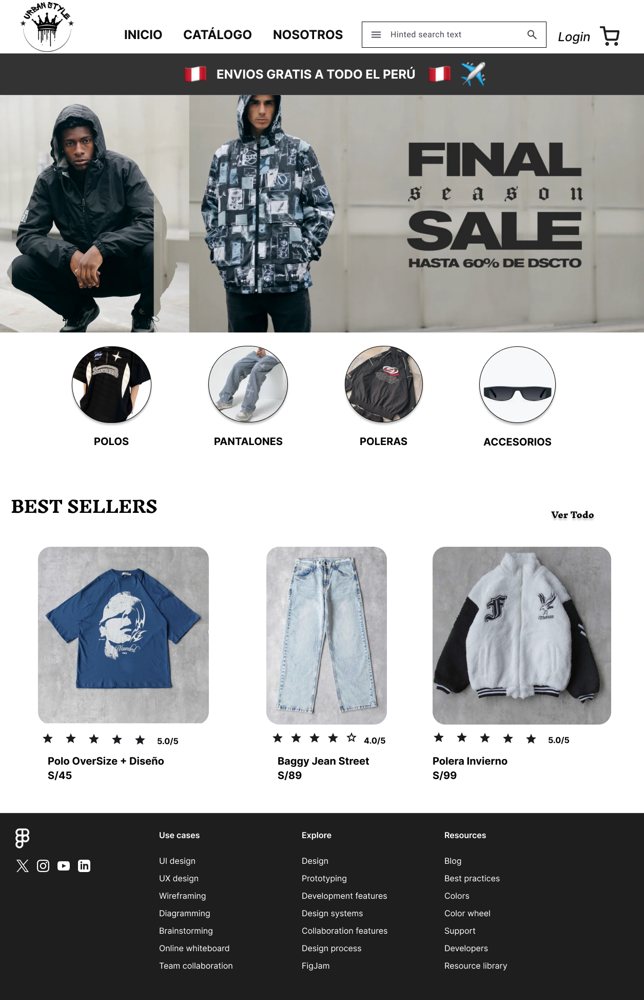

 

# Urban Style Web App

## 📝 Descripción del Proyecto
Urban Style es una tienda dedicada a la venta de ropa de moda urbana, especializada en ofrecer prendas y accesorios que reflejan las últimas tendencias del estilo callejero. Este aplicativo web tiene como objetivo optimizar la gestión de ventas, mejorar la experiencia de compra y potenciar la presencia digital de la empresa.

## 🚩 Problemática
Urban Style enfrenta desafíos significativos. Actualmente, no cuentan con un sistema de compras online, lo que limita su capacidad para llegar a un público más amplio. Además, la falta de un registro de inventario eficiente dificulta la gestión de sus prendas, afectando la disponibilidad y el servicio al cliente.

## 🎯 Objetivo General
Desarrollar un aplicativo web para Urban Style que optimice la gestión de ventas, mejore la experiencia de compra de los clientes y potencie la presencia digital de la empresa.

## 🎯 Impacto en los procesos
El desarrollo del aplicativo web para Urban Style tendrá un impacto significativo en varios procesos clave de la empresa:
1.	**Gestión de Ventas:** La implementación de un sistema automatizado permitirá un control más preciso y eficiente de las compras y el inventario, reduciendo errores y mejorando el flujo de trabajo.
2.	**Experiencia de Compra:** Los clientes podrán realizar compras en línea de manera fácil y rápida, accediendo a un catálogo completo y personalizado que mejorará su satisfacción. Esto ayudará a fidelizar a los clientes y atraer nuevos consumidores que buscan comodidad en sus compras.
3.	**Transparencia y Seguimiento de Pedidos:** Con la posibilidad de rastrear pedidos en tiempo real, se mejorará la confianza de los clientes en la marca, lo que fortalecerá la reputación de Urban Style y fomentará relaciones duraderas con los clientes.

## 🎯 Alcance de la Solución Informática
El desarrollo del aplicativo web para Urban Style se plantea como la solución integral a las problemáticas identificadas. Este incluirá:
1.	**Funcionalidad de Compras en Línea:**
•	Registro de Usuarios: Permitir a los clientes crear cuentas, acceder a ellas y recuperar contraseñas, facilitando así el acceso al sistema.
•	Selección de Prendas: Ofrecer un catálogo fácil de navegar donde los usuarios puedan seleccionar atributos de productos, mejorando la experiencia de compra.
2.	**Gestión de Carrito de Compras:**
•	Flexibilidad: Permitir a los usuarios agregar, modificar y eliminar productos en el carrito, proporcionando un resumen claro del total de la compra.
3.	**Proceso de Compra Simplificado:**
•	Métodos de Pago y Entrega: Incluir opciones como Yape y tarjeta, y modalidades de envío o recogida, adaptándose a las preferencias de los clientes.
4.	**Gestión de Inventario para Administradores:**
•	Actualización en Tiempo Real: Facilitar la gestión del inventario, asegurando que el stock refleje la disponibilidad real de los productos.
5.	**Automatización de Procesos:**
•	Eficiencia en la Gestión: Implementar sistemas que automaticen la actualización del inventario y el seguimiento de pedidos, mejorando la eficiencia operativa.

## 🔑 Características
- **Catálogo de Productos:** Acceso a una amplia gama de ropa urbana y accesorios.
- **Sistema de Compras Online:** Posibilidad de realizar compras desde la plataforma.
- **Opciones de Pago:** Métodos de pago en línea integrados (boleta/factura, envío a domicilio o recojo en tienda, pago por Yape o tarjeta).
- **Seguimiento de Pedidos:** Funcionalidad para rastrear el estado de los pedidos.
- **Gestión de Inventario:** Herramientas para que los administradores gestionen el inventario de productos.
- **Registro y Login:** Para tres tipos de cuentas: cliente, empleado y administrador.
- **Carrito de Compras:** Opción para agregar, eliminar y proceder a la compra.
- **Dashboard de Estadísticas:** Para administradores, sin opción de modificar datos.
- **Gestión de Cuentas:** Administradores pueden agregar, modificar y eliminar otros administradores y empleados.

## 🛠️ Requisitos Previos
Antes de comenzar con la instalación, asegúrate de tener lo siguiente:
- **[☕ Java JDK 1.8 o superior](https://www.oracle.com/java/technologies/javase/javase-jdk8-downloads.html)**: Necesario para compilar y ejecutar el proyecto.
- **[📦 Maven](https://maven.apache.org/download.cgi)**: Utilizado para gestionar dependencias y construir el proyecto.
- **[🌐 Apache Tomcat](https://tomcat.apache.org/)**: Un servidor de aplicaciones compatible con Java EE para desplegar la aplicación.

## 🛠️ Tecnologías Utilizadas
- **Java**: Lenguaje de programación principal.
- **HTML**: Estructura del contenido web.
- **CSS**: Estilos y diseño de la interfaz de usuario.
- **JavaScript**: Funcionalidades interactivas en el front-end.
- **Maven**: Gestión de dependencias y construcción del proyecto.

## 🎨 Diseño Frontend

[Ver Prototipo](https://www.figma.com/design/iGYcEdPROoZ7eYLJHx0zZ2/Untitled?node-id=0-1&t=NC8lq16Ep4zBlZg2-1)

## 🤝 Contribuciones
¡Apreciamos las contribuciones! Si deseas colaborar, puedes abrir un problema (issue) o enviar una solicitud de extracción (pull request) en nuestro [repositorio de GitHub](https://github.com/Erit18/UrbanStyleWebApp).

## 👥 Autores 
**Equipo de Desarrollo**
- **👤 Adrián Ramos Barzola**: [adrianrb111@gmail.com](mailto:adrianrb111@gmail.com)
- **👤 Sebastián Geovanni Buitrón Velásquez**: [sebasgeo@gmail.com](mailto:email@ejemplo.com)
- **👤 Kevin Arnold Clemente Albornoz**: [kevinarn@gmail.com](mailto:email@ejemplo.com)
- **👤 Danna Roxanne Susanibar Quispe**: [dannarox@gmail.com](mailto:email@ejemplo.com)
- **👤 Fabian García Champi**: [fabiangarc@gmail.com](mailto:email@ejemplo.com)