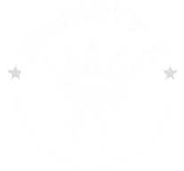

 

## Descripción del Proyecto
Urban Style es una tienda dedicada a la venta de ropa de moda urbana, especializada en ofrecer prendas y accesorios que reflejan las últimas tendencias del estilo callejero. Este aplicativo web tiene como objetivo optimizar la gestión de ventas, mejorar la experiencia de compra y potenciar la presencia digital de la empresa.

## Problemática
Urban Style enfrenta desafíos significativos. Actualmente, no cuentan con un sistema de compras online, lo que limita su capacidad para llegar a un público más amplio. Además, la falta de un registro de inventario eficiente dificulta la gestión de sus prendas, afectando la disponibilidad y el servicio al cliente.

## Objetivo General
Desarrollar un aplicativo web para Urban Style que optimice la gestión de ventas, mejore la experiencia de compra de los clientes y potencie la presencia digital de la empresa.

## Objetivos Específicos
- Implementar un sistema de ventas automatizado.
- Desarrollar una base de datos.
- Ofrecer un amplio catálogo de ropa urbana en línea.
- Integrar múltiples opciones de pago en línea.
- Incluir funcionalidades de seguimiento de pedidos.
- Facilitar opciones de entrega y recogida en tienda.

## Características
- **Catálogo de Productos**: Acceso a una amplia gama de ropa urbana y accesorios.
- **Sistema de Compras Online**: Posibilidad de realizar compras desde la plataforma.
- **Opciones de Pago**: Métodos de pago en línea integrados.
- **Seguimiento de Pedidos**: Funcionalidad para rastrear el estado de los pedidos.
- **Gestión de Inventario**: Herramientas para que los administradores gestionen el inventario de productos.

## Requisitos Previos
Antes de comenzar con la instalación, asegúrate de tener lo siguiente:
- **[Java JDK 1.8 o superior](https://www.oracle.com/java/technologies/javase/javase-jdk8-downloads.html)**: Necesario para compilar y ejecutar el proyecto.
- **[Maven](https://maven.apache.org/download.cgi)**: Utilizado para gestionar dependencias y construir el proyecto.
- **[Apache Tomcat](https://tomcat.apache.org/)**: Un servidor de aplicaciones compatible con Java EE para desplegar la aplicación.

## Tecnologías Utilizadas
- **Java**: Lenguaje de programación principal.
- **HTML**: Estructura del contenido web.
- **CSS**: Estilos y diseño de la interfaz de usuario.
- **JavaScript**: Funcionalidades interactivas en el front-end.
- **Maven**: Gestión de dependencias y construcción del proyecto.

## Diagrama de Entidad-Relación

## Diseño Frontend

[Ver Prototipo](enlace-al-prototipo)

## Contribuciones 🤝
¡Apreciamos las contribuciones! Si deseas colaborar, puedes abrir un problema (issue) o enviar una solicitud de extracción (pull request) en nuestro [repositorio de GitHub](https://github.com/Erit18/UrbanStyleWebApp).

## Autores 
**Equipo de Desarrollo**
- **Adrián Ramos Barzola**: [adrianrb111@gmail.com](mailto:adrianrb111@gmail.com)
- **Nombre de Tu Compañero**: [email@ejemplo.com](mailto:email@ejemplo.com)